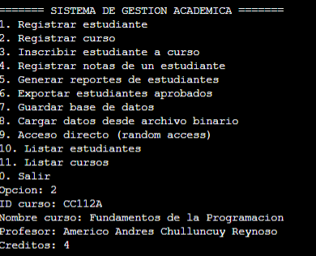

# Sistema Académico en C++

## Descripción del proyecto
Sistema académico desarrollado en C++. 
Permite registrar estudiantes y cursos, inscribir estudiantes en curso,
registrar notas y generar reportes.
El programa usa programación orientada a objetos y manejo de archivos
en texto y binario.

## Guía de compilación y ejecución
El proyecto se compila usando un **Makefile**.

## Diseño del sistema
### Clase Persona
La clase Persona contiene datos como el ID y el nombre.
Tiene constructores y métodos simples para obtener y modificar estos
datos.
Esta clase es base para el diseño del sistema.

### Clase Estudiante
La clase Estudiante tiene datos como carrera, ciclo, notas y los cursos en los que está
inscrito.
Permite:
- Registrar notas
- Calcular el promedio
- Inscribirse en cursos
- Mostrar su información
Los cursos se guardan en un arreglo y se verifica que no se repitan.

### Clase Curso
La clase Curso representa un curso del sistema.
Contiene datis como el nombre del curso, profesor, créditos y los
estudiantes inscritos. Tambien funciones para inscribir estudiantes 
y mostrar la información del curso.

### Clase Sistema
La clase Sistema es la parte principal del programa.
Se encarga de manejar el registro de estudiantes, cursos, inscripciones, 
notas y reportes.
Para guardar los estudiantes y cursos se usan arreglos dinámicos.
Cuando se llena el espacio, el sistema aumenta el tamaño del arreglo para
seguir agregando datos.

## Justificación del uso de punteros inteligentes
En este proyecto se utilizan punteros inteligentes (`unique_ptr`) para
manejar los arreglos dinámicos de estudiantes y cursos.
Se usaron porque facilitan el manejo de memoria y evita fugas de memoria.
Tambien para hacer que el código sea más seguro y ordenado, cuando se necesita 
cambiar el tamaño de los arreglos al registrar más estudiantes o cursos.

## Ejemplos de ejecución
### Registro de estudiante

### Inscripción de estudiante en curso

